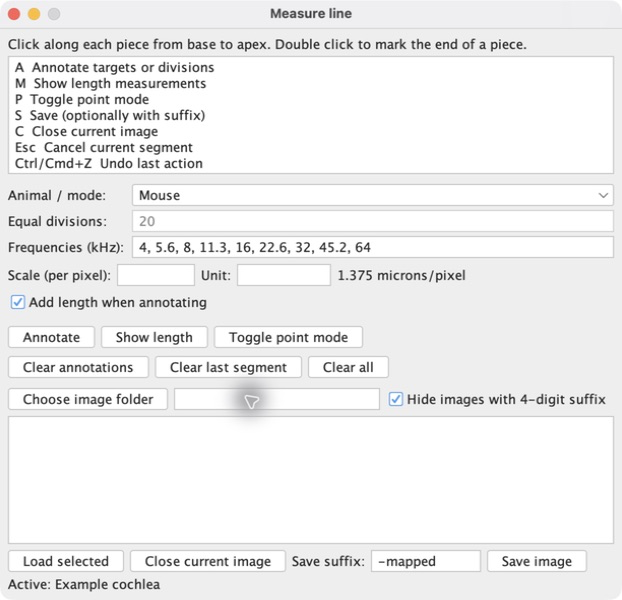

# Cochlear Length FIJI Plugin

This is the Eaton-Peabody Laboratories (EPL) `Measure_line.class` repackaged as a Fiji plugin with a bug fixed and some additional features. The original plugin, equations, and workflow are EPL's work and are available on the website of the [EPL Histology Core](https://masseyeandear.org/research/otolaryngology/eaton-peabody-laboratories/histology-core).

Compared to the original `Measure_line.class`, this plugin:

- Fixes the broken macOS plugin path.
- Adds a GUI that persistently stores the annotation mode (mouse, human, equal division, etc.).
- Adds an option to put the total cochlea length on the image.
- Adds options to clear annotations or selections.
- Remains active while opening and closing multiple images.
- Adds useful controls for higher-throughput mapping, including opening, closing, and saving images from the GUI with an optional suffix.

## Install

1. Open your Fiji installation folder.
2. Copy [`Measure_line.jar`](Measure_line.jar) into its `plugins` folder.
3. Restart Fiji.

## Usage

1. Choose **Plugins > Tools > Measure line**.
2. Press **Choose image folder**.
3. Choose an image and press **Load selected**.
4. Click along each piece from basal to apical. Finish each piece by double-clicking.
5. Set **Animal / mode** and the **Frequencies (kHz)** of interest.
6. Optionally set the scale and unit, and toggle **Add length when annotating**.
7. Press **Annotate** or **A**.
8. Press **Save image** or **S**.

**Show length** or **M** reports the length of each piece and the total length. **Toggle point mode** or **P** shows the frequency at a specific point; left-click to add a frequency label. Press **Esc** to cancel an unfinished piece, or **Ctrl/Cmd+Z** to undo the latest label, annotation, or stored piece.

## (Optional) batch stitching

The batch script automatically places tiles with the same basename before the final `-####` into a folder with that basename, then runs each folder individually. It joins pieces belonging to one cochlea, stitching overlapping pieces into a whole and placing non-overlapping pieces next to each other. The output pseudocolor can be chosen when the script starts.

1. Open your Fiji installation folder and copy [`Batch_Stitching.ijm`](Batch_Stitching.ijm) into its `macros` folder.
2. Restart Fiji.
3. Choose **Plugins > Macros > Run**, select the macro, then select the image folder.

Tile names must end in `-####`, for example `GEK1756-B-0001.tif`, `GEK1756-B-0002.tif`, and `GEK1756-B-0003.tif`. Files without that four-digit suffix are ignored.
